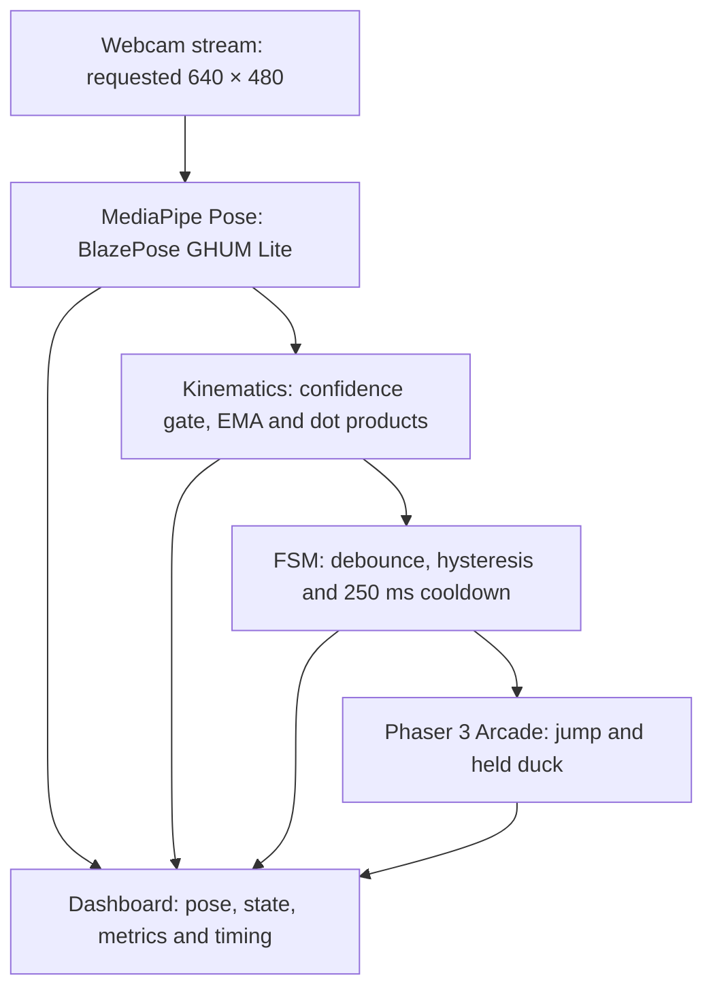
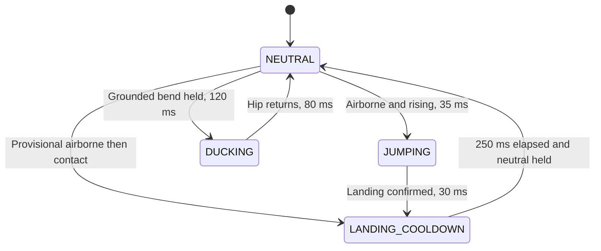

# CV-Controlled Endless Runner

### 🎥 Demo Video: [Insert Video Link Here - Optional / Recorded Live]

After the initial dependency/runtime downloads, play fully offline in Electron or a browser served on localhost. The optional live recording is not yet attached.

## Evaluator quick-start

Install **Git and Node.js 22 or 24**, then copy this line into Bash or PowerShell 7:

```bash
git clone https://github.com/satishkumar123123/cv-controlled.git cv-endless-runner && cd cv-endless-runner && npm ci && npm test && npm run desktop
```

The explicit clone destination matches `cd cv-endless-runner`. For browser mode,
replace the final command with `npm run dev` and open **http://localhost:3000**.
First-install time depends on connection speed and the Electron download; a
fresh setup cannot be guaranteed to finish in under two minutes.

Windows PowerShell 5.1 does not support `&&`; run these commands one at a time:

```powershell
git clone https://github.com/satishkumar123123/cv-controlled.git cv-endless-runner
cd cv-endless-runner
npm ci
npm test
npm run desktop
```

| Evaluation mode | Start and controls |
| --- | --- |
| **Camera control (default)** | Click **Start camera**, stand fully in view for the 3 s calibration, then physically jump or hold a crouch. After collision, **R**, **Space** or **Restart run** restarts. |
| **Keyboard fallback — no webcam required** | Click **Keyboard test mode**. **Space** jumps, hold **Down Arrow** to duck, release it to stand, and **R** restarts. Space also restarts after collision. Click the game if a text field has focus. |

Keyboard mode stops the camera and clears the pose/performance sample. It tests
gameplay without generating biomechanical metrics or camera-action latency.
Switch back with **Use camera controls**, then **Start camera** and recalibrate.
After focus loss, release held keys and press a fresh control key to resume.

**Submission links:** [Source](https://github.com/satishkumar123123/cv-controlled) ·
[CI and Windows EXE artifacts](https://github.com/satishkumar123123/cv-controlled/actions/workflows/verify.yml) ·
[Assignment audit](docs/ASSIGNMENT_AUDIT.md) ·
[Measured benchmark JSON](benchmarks/2026-10-02-software-webgl.json) ·
[Manual observation sheet](docs/manual-validation.csv) ·
[Assignment squat reference](docs/assets/squat-depth-reference.jpg).

## Project overview

A single-webcam endless runner that turns physical **jumps** and **held ducks**
into responsive Phaser 3 actions. Calibrated foot contact, temporal gesture
classification and confidence-gated biomechanics run in the browser. The
dashboard presents camera/skeleton feedback, controller state, movement metrics
and live inference/action timing.

The engineering priority is reliable control: one action per qualifying movement,
stable recovery after landing, safe tracking loss, and bounded game resources.
The submission includes **214 passing tests across eight suites** (the original
206 plus eight keyboard-mode regression tests), browser collision
and restart checks, a recorded cloud benchmark, and a target-device evaluation
protocol. Physical-webcam performance and clinical measurement accuracy require
separate validation on the evaluator's hardware.

The complete [assignment compliance matrix and manual evaluation protocol](docs/ASSIGNMENT_AUDIT.md)
identifies the implemented requirements and the remaining physical-device evidence.
The supplied [squat reference image](docs/assets/squat-depth-reference.jpg) matches
the four angular bands documented below.

| Evaluation criterion | Delivered capability | Evidence |
| --- | --- | --- |
| Webcam-controlled runner | Red jump hurdles, purple ceiling barriers, held duck, score/restart/protection | `GameScene.js`, `main.js`, real Phaser browser checks |
| Reliable classification | Debounce, hysteresis, confirmed/provisional landing recovery, neutral rearming | `GestureClassifier.test.js`, `RegressionAudit.test.js` |
| Calibration and visibility | Three-second standing hold, per-marker foot baselines, raw confidence gate | `PoseTracker.test.js`, calibration regression fixtures |
| Movement analytics | Bilateral knee/hip/ankle angles, signed flexion/extension proxies, phase history, independent squat metadata, flight-time height estimate | `Kinematics.test.js`, `ActionRecorder.test.js`, analytics DOM tests |
| Desktop delivery | Electron app, bundled model/WASM, permission handling, platform packaging | Desktop smoke check and packaging commands |
| Performance instrumentation | Inference, accepted-action latency and completed-result FPS | `PerformanceMonitor.test.js`, raw benchmark JSON |
| Reproduction and technical defense | Commands, exact thresholds/formulas, sources, limitations and device protocol | This README |

**Reading guide:** [Quick evaluation](#quick-demo--testing-guide) ·
[Architecture](#system-architecture-and-model-selection) ·
[Detection](#detection-logic-and-finite-state-machine) ·
[Kinematics](#biomechanical-formulas-and-coordinate-conventions) ·
[Guardrails](#edge-case-hardening-and-guardrails) ·
[Benchmarks](#performance-and-latency-profiling) ·
[Technical defense](#technical-defense-and-validation-boundaries) ·
[Tests](#automated-test-suite-and-verification).

## Setup and execution

Use Node.js 22 or 24, npm, a webcam and a browser with WebAssembly/WebGL support.
The automated checks documented below used Node.js 24.19.0 and Chromium 153.
Run these commands from the repository folder in a terminal (including VS Code's
PowerShell terminal on Windows):

```bash
npm ci
npm test
npm run dev
```

Open the address Vite prints, normally **http://localhost:3000**. `npm ci` installs
the exact committed lockfile; `npm install` is also available for development.

```bash
npm run test       # Vitest; runs all tests once and exits
npm run build      # Production files in dist/
npm run preview    # Serve the built app locally
```

### Desktop application

```bash
npm ci
npm run desktop       # Build and launch an Electron desktop window
npm run desktop:pack  # Create an unpacked application under release/
npm run desktop:dist  # Create a Windows portable EXE, macOS ZIP, or Linux ZIP on that OS
```

Node is required for source commands; packaged applications include their own
runtime. Evaluate a Windows build on Windows and a macOS build on macOS. The
provided packages are unsigned; signing/notarization is not configured.
The [GitHub Actions workflow](https://github.com/satishkumar123123/cv-controlled/actions/workflows/verify.yml)
tests the project and builds a Windows portable artifact. Open the latest successful
`main` run, select **Artifacts → CV-Controlled-Runner-Windows**, extract the
downloaded ZIP and launch its EXE. Artifact downloads require a GitHub sign-in
and expire according to the repository's retention policy; the source commands
above remain the reproducible delivery path.

`desktop/main.cjs` loads a stable secure `app://runner` origin, with renderer
Node integration disabled, context isolation/sandboxing enabled, navigation
restricted and camera-only permission handling. A camera permission dialog is
shown after **Start camera**. Model assets and game assets are local; outgoing
HTTP(S) requests are blocked in the desktop session. Closing the window releases
its camera resources. The stable origin preserves the high score across launches.

### Model download and offline assets

`npm ci` downloads the pinned MediaPipe npm package. Its postinstall script
copies Lite, graph and WASM/runtime files to generated `public/pose/`; build
copies them into `dist/pose/`. `predev` and `prebuild` repeat this preparation.
`index.html` loads the pinned `pose.js` and `camera_utils.js` as local classic
scripts before the application module. These SDKs publish browser globals, not
native named ES-module exports; treating them as named imports can pass Vite
development checks but produce a `Pose is not a constructor` production error.
`PoseSDK.js` validates their availability, and `test:model` exercises the built
application with the real model to catch this regression.
These generated model files are ignored by Git; no separate model URL or manual
download is needed. The desktop package includes them and runs without a CDN.
If installation was run with `--ignore-scripts`, run
`node scripts/prepare-pose-assets.mjs` before starting. Electron's runtime binary
also downloads during installation/first launch, so allow install-time internet.

Camera access requires **HTTPS or localhost**. A plain HTTP LAN address generally
cannot access the camera. Click **Start camera**, grant permission, and allow
model assets to load. If access is denied, change the site's camera permission
in browser settings and retry. Close other applications using the webcam if it
is busy. Embedded deployments must also allow camera access in their iframe and
Permissions Policy. Browser and desktop modes use the locally prepared models.

## Quick Demo & Testing Guide

For a webcam-free gameplay check, use [Keyboard test mode](#evaluator-quick-start).
The following protocol evaluates the primary camera controller.

1. **Frame the player:** start about **2–2.5 meters** from a fixed webcam in good
   lighting. Adjust for its field of view until shoulders, hips, knees, heels
   and toes are visible, with room above your head for a jump.
2. **Calibrate:** click **Start camera**, allow camera access, and stand still
   in neutral for the **3-second** countdown. Wait for `NEUTRAL` and the game to
   start; movement, occlusion or a failed neutral check restarts calibration.
3. **Jump test:** make one standard jump as a **red low obstacle** approaches.
   Expect one in-game jump, then `LANDING_COOLDOWN` on landing. The landing knee
   bend should not produce a duck. Stand neutrally to rearm.
4. **Duck test:** perform a comfortable **parallel/full squat** for a **purple
   high barrier**, and hold until it passes. The character should stay gold with
   its short hitbox, then stand when you rise. The game's duck trigger uses hip
   drop and knee bend; it does not require a particular squat-depth label.
5. **Occlusion test:** briefly move a foot out of frame. Expect tracking to pause
   and movement metrics to show **—** (unavailable), with no false jump/duck or
   stale jump height. Return fully into view and stand still to resume.
6. **Restart:** after collision, click the game and press **R** (or **Space**),
   or click **Restart run** / the canvas **Restart** prompt. Return to neutral.
   Use **Recalibrate / Restart** if the camera or your standing position changes.
7. **Review measurements:** open **Joint angles & action history** for live left/right
   knee, hip and ankle angles and the last completed action's phase ranges. After
   warm-up, reset the performance sample, enter hardware notes and click
   **Export session JSON** to retain timing averages and numeric action samples.

For an automated evaluator check, run `npm run test` and `npm run build`.
For a real-device performance record, use **Reset sample** and **Log performance
summary** with the benchmark protocol below; demo success alone is not a latency
measurement.

## Baseline calibration and input quality

Calibration requires **three continuous seconds**, at least **30 valid
observations** and a successful neutral self-check. Stand upright with straight
legs, facing a fixed, level camera. Movement or missing landmarks resets the hold.
Use **Recalibrate / Restart** after changing the camera, distance, orientation
or player. Missing tracking pauses physics and score; stable neutral input is
required to resume. **Stop camera** releases capture.

During model loading or a pending permission prompt, the same button becomes
**Cancel camera startup**. Cancellation releases acquired tracks immediately
and lets the app return to its start controls without waiting indefinitely.

Calibration averages these filtered **normalized image** quantities over the hold:

| Baseline field | Calculation |
| --- | --- |
| `baselineHipY` | Mean Y of left/right hips (23, 24) |
| `baselineFootY` | Mean Y of heels and foot indices (29, 30, 31, 32) |
| `baselineLeftHeelY` / `baselineRightHeelY` | Individual mean Y for heels 29 / 30 |
| `baselineLeftToeY` / `baselineRightToeY` | Individual mean Y for foot indices 31 / 32 |
| `torsoHeight` | 2D Euclidean distance between mid-shoulder and mid-hip |
| `shoulderWidth` | 2D Euclidean distance between shoulders (11, 12) |
| `footYStdDev` / `footYNoiseEnvelope` | Raw Y sample standard deviation and 3σ envelope, indexed by landmark 29–32 |

Image Y increases downward. These distances use normalized XY, not meters.
Raw landmarks must stay within **0.10 × initial torso height** of their initial
positions throughout calibration; this catches cumulative drift. Image-plane
knee interior angles must be at least **160°**. Other upright checks require
torso height ≥ 0.06, shoulder width ≥ 0.04, shoulder-to-hip vertical separation
≥ 85% of torso length, shoulder height difference ≤ 40% of shoulder width, and
hip-to-knee/knee-to-ankle vertical separations ≥ 0.04. These are game heuristics,
not a clinical posture assessment.

Ground contact uses each marker's own baseline, so a naturally higher heel and
lower toe cannot permanently disarm the controller. `baselineFootY` remains a
summary and fallback for legacy callers that supply none of the four individual
baselines; a partially populated new baseline is rejected. Raw foot noise uses
online sample variance, independent of EMA smoothing. A 3σ envelope larger than
`max(0.025, 0.10 × torsoHeight)` restarts calibration rather than widening ground
contact indefinitely.

The final 300 ms of filtered frames (bounded to 64 observations) are replayed
through the same classifier with no action callbacks. Their joint geometry,
visibility, contacts, hip position and velocity must satisfy neutral, including
the 120 ms hold. Failure restarts calibration with a status message. Successful
history is handed to the live classifier to arm immediately; normal restarts
and tracking recovery still require a new neutral hold.

## System architecture and model selection

MediaPipe Pose (BlazePose GHUM Lite, `modelComplexity: 0`) was chosen because its
**33 landmarks** include heels and foot indices needed for grounded/takeoff
checks, as well as shoulder, hip, knee and ankle joints. Its detector/tracker
pipeline can reuse tracking between frames. The JavaScript runtime executes
locally using WASM/WebGL; there is **no server inference round trip**. This does
not imply zero processing latency. See the [MediaPipe Pose documentation][pose-docs].

This repository uses the pinned legacy `@mediapipe/pose@0.5.1675469404` and
`@mediapipe/camera_utils@0.3.1675466862` APIs, not the newer Tasks Vision API.
Segmentation and built-in landmark smoothing are disabled. Detection/tracking
confidence thresholds are 0.65; the app applies one explicit EMA itself.

### Architecture overview



Capture resolution is requested through `camera_utils`; actual negotiated
settings are recorded by the profiler. The model returns 33 normalized/image
and estimated world landmarks. Calibration and foot contact use image position;
joint angles prefer the world-coordinate skeleton. Rendering, physics and
camera inference have separate clocks and rates.

| Technology | Selection rationale |
| --- | --- |
| Phaser 3 Arcade Physics | Simple rectangular collision bodies, synchronous velocity/hitbox commands, reusable groups and scene lifecycle hooks. The installed Phaser 3.90.0 defaults to fixed physics steps at 60 Hz; reproducible body rules do not imply guaranteed 60 FPS rendering or inference. See the [versioned engine source][phaser-world]. |
| MediaPipe Pose + WASM/WebGL | Browser inference removes the server round trip and keeps camera frames local. BlazePose's heels/toes enable bilateral takeoff/contact checks; Lite reduces model work. [Official model documentation][pose-docs] describes the outputs and complexity tradeoff. |
| Vite + modular JavaScript | Fast local development and production bundling; vision, analytics, classification and gameplay remain separately reviewable. |
| Vitest + browser integration checks | Pure geometry and timestamp fixtures test decision boundaries; actual Arcade bodies test collision order, pooling and restart behavior. |

**API identity:** this implementation uses the legacy Pose Solution API. The
newer [MediaPipe Tasks-Vision `PoseLandmarker` API][tasks-docs] is a distinct
integration and is not installed here. Results from that API cannot be presented
as measurements of this repository.

| Module | Responsibility |
| --- | --- |
| `src/vision/PoseTracker.js` | Camera lifecycle, frame timing, inference, visibility gate, EMA, calibration, canvas overlay |
| `src/analytics/Kinematics.js` | Pure geometry and ballistic estimation with invalid-input guards |
| `src/vision/GestureClassifier.js` | Temporal FSM, confidence checks, debouncing, recovery, repetition metrics |
| `src/analytics/PerformanceMonitor.js` | Inference/action timing, processing FPS, session summaries and browser hardware hints |
| `src/analytics/ActionRecorder.js` | Bounded per-action bilateral joint samples, preparation/takeoff/flight/landing ranges |
| `src/analytics/SessionReport.js`, `src/ui/ActionAnalytics.js` | Session evidence export and live/historical angle presentation |
| `desktop/` | Isolated Electron window, local asset protocol, video permission and packaging entry point |
| `src/game/GameScene.js` | Arcade physics, obstacle pool, score, collision/restart and tracking pause |
| `src/main.js` | Callback wiring, accepted-action timing, DOM analytics and performance HUD |

The per-frame path is camera → MediaPipe → confidence gate/EMA → calibration or
kinematics/FSM → Phaser command → analytics. Drawing and classification run after
the inference timer ends. Only **one inference** is in flight; frames arriving
while it runs are not queued. `requestVideoFrameCallback` schedules fresh video
frames where available. The fallback uses `requestAnimationFrame` and skips an
unchanged `video.currentTime`. The camera utility owns capture; its metadata
scheduling hook is replaced so the application can cancel its own loop cleanly.

Required landmarks are 11/12, 23/24, 25/26, 27/28, 29/30 and 31/32. Any missing,
non-finite, offscreen or visibility **< 0.65** required landmark invalidates input
before filtering. Visibility is never smoothed. The coordinate EMA is:

$$\alpha(\Delta t)=1-(1-0.4)^{\Delta t/(1000/30)},\qquad
\hat p_t=\hat p_{t-1}+\alpha(\Delta t)(p_t-\hat p_{t-1}).$$

Here Δt is in milliseconds (clamped to at least 1 ms). This approximates the same
filter lag at different frame rates. Invalidation clears filter and motion
history, cancels incomplete metrics, releases an active duck once and requires
neutral recovery. Results older than **500 ms** are discarded for control. A
250 ms watchdog invalidates hidden-tab/frozen-camera input; a separate **200 ms**
classifier timestamp-gap limit prevents unsafe velocity estimates across gaps.

The application passes `/pose` as `assetBaseUrl`, serving model/WASM files copied
from the pinned npm package. The reusable `PoseTracker` class retains a pinned
jsDelivr fallback for external callers that omit that option. Webcam frames and
landmarks are not uploaded. Keep all generated relative asset names intact when
hosting the production build.

## Detection logic and finite state machine

Let H be calibrated `torsoHeight`, D = (hipY − baselineHipY) / H, and U be upward
hip velocity in torso heights/second. Raw U is `(previousHipY − hipY) / (Δt × H)`
with Δt in seconds, then an exponential velocity filter uses time constant 60 ms.
All gesture timestamps use the source frame's monotonic clock.



| Rule | Exact default condition |
| --- | --- |
| Foot grounded | Either heel or toe within ±T of its own baseline, where T = max(0.025, 0.10 H) |
| Both feet airborne | All four heel/toe points rise more than max(0.12 H, T + 0.02 H) above their own baselines |
| Provisional airborne | All four heel/toe points rise beyond T, even without sustained takeoff or sufficient hip speed |
| Neutral/rearm | Both feet grounded, \|D\| ≤ 0.05, mean knee flexion < 25°, \|U\| ≤ 0.12, held for 120 ms |
| Jump trigger | Airborne AND U > 0.6, sustained for 35 ms while armed |
| Landing | Either foot grounded, U ≤ 0.12, ≥100 ms since takeoff, contact sustained for 30 ms |
| Landing cooldown | At least 250 ms **after confirmed landing**, plus stable neutral; no duck trigger in this state |
| Provisional landing cooldown | First ground contact after provisional airborne observation starts the same 250 ms suppression and neutral-recovery gate; no jump event or flight metrics are invented |
| Duck start | Both feet grounded, D > 0.15 AND mean knee flexion > 40°, sustained for 120 ms while armed |
| Duck end | Both feet grounded and \|D\| ≤ 0.05 for 80 ms; rearm requires stable neutral again |
| Bottom pause | Hip within 0.03 H of deepest observed duck position and \|U\| ≤ 0.12 for at least 120 ms |
| Invalid flight | Flight lasting >2000 ms, missing geometry, or a frame gap >200 ms discards incomplete flight metrics |

The gap above adaptive contact tolerance and the 0.15/0.05 hip thresholds provide hysteresis.
Exactly one state branch is evaluated per frame. `JUMPING` cannot trigger a duck
or another jump. A landing knee bend remains recovery **even beyond 250 ms**
until the user stands neutrally. Rising from a duck cannot immediately trigger a
jump. Foot lift without upward hip velocity, head movement, sway and brief
single-frame spikes do not meet the full trigger conditions.

Takeoff time is the **first qualifying airborne/rising frame**, retained through
the debounce window. Landing time is the **first qualifying contact frame**,
retained through its confirmation window. Their difference is the measured
flight time. The peak hip rise includes the takeoff candidate frames and is
`max(0, baselineHipY − minimumHipY)`, in normalized frame-height units.
Bottom pause accumulates qualified stationary segments at the deepest observed
position; a substantially deeper position discards shallower pauses.

Thresholds are constructor-overridable in `GestureClassifier`, subject to
validation (including cooldown ≥250 ms). They still require real-user validation;
synthetic test coverage alone does not establish detection accuracy.

## Biomechanical formulas and coordinate conventions

For three visible points a, b, c in one coordinate scale, define u = a − b and
v = c − b. The interior angle at b is:

$$\theta(a,b,c)=\frac{180}{\pi}\cos^{-1}\left(
\operatorname{clamp}\left(\frac{u\cdot v}{\lVert u\rVert\lVert v\rVert},-1,1\right)\right).$$

Zero-length segments, missing/non-finite coordinates, overflowing geometry and
landmarks with visibility outside 0.65–1 return `null`; the classifier publishes `valid: false` when
required geometry is unavailable. Unknown values display as **—**, not zero.
Losing any required hip, knee, ankle, heel or toe clears all movement fields,
including previous flight/jump values, and shows the tracking-loss reason in
the state field. Processing FPS/inference timing can remain available because
model processing continues during occlusion. A reliable straight knee can
legitimately display 0°; an occluded knee must display **—**.

- **Knee flexion:** `180° − θ(hip, knee, ankle)`. A straight leg is 0°;
  a right-angle bend is 90°. The dashboard averages the two knees. Mean flexion
  **>40°** is the game's duck threshold when grounded hips also drop; it is not
  a standalone clinical definition of a squat.
- **Hip flexion proxy:** `180° − θ(shoulder, hip, knee)`, averaged bilaterally.
  This is an unsigned thigh-to-torso departure from straight neutral. It does
  not isolate anatomical sagittal flexion from extension/abduction or measure
  pelvic orientation.
- **Signed hip flexion/extension:** project torso and thigh perpendicular to
  the anatomical left-to-right hip vector `r`. Let `u` be projected unit torso-up,
  `q` projected unit thigh and `f = u × r`. The signed estimate is
  `atan2(q·f, −q·u) × 180/π`: positive flexion, negative extension, neutral 0°.
  It uses MediaPipe's anatomical side labels and estimated XYZ body plane;
  a degenerate plane returns `null`. This additional signed proxy does not alter
  the original unsigned angle used for squat-band classification.
- **Ankle dorsiflexion/plantarflexion:** `90° − angle(knee − ankle, toe − heel)`.
  A shin perpendicular to the heel-to-foot-index segment is 0°; positive is
  dorsiflexion and negative is plantarflexion. Left and right are shown separately.
  A coincident/occluded foot segment returns `null`; the mean is available only
  when both ankles are reliable. This is a 3D shin/foot proxy: foot rotation,
  inversion, footwear and inferred depth can bias it. It is not a calibrated
  clinical ankle measurement.
- **Torso lean:** for t = midShoulder − midHip in aspect-corrected image XY,
  `acos(−t.y / ||t||) × 180/π`. Upright is 0°. Image up `(0, −1)` approximates
  gravity only with a level, fixed camera; forward/backward lean can be hidden
  in a frontal view.
- **Stance width ratio:** `distanceXY(leftAnkle, rightAnkle) / shoulderWidth`.
  Both use the same unscaled normalized image XY as calibration. Perspective,
  camera aspect and changes in orientation can bias this apparent width ratio.

Joint angles prefer MediaPipe `poseWorldLandmarks`, whose estimated 3D
coordinates have an origin between the hips. Image-based fallback maps
`(x, y, z)` to `(aspect × x, y, aspect × z)` because image Z is scaled like X.
World coordinates are inferred from one RGB view; they are not depth-camera
measurements. Hip-relative world translation must **not** be used to measure a
jump. See [output coordinate definitions][pose-docs]. `angleSource` in the metrics
payload identifies `world-3d` or `image-3d-estimate`.

**Action and phase history:** the live bilateral panel shows knee flexion,
signed hip flexion/extension and signed ankle dorsi/plantarflexion. The last
completed action has min/max ranges for each side and phase. Jump preparation is
a 500 ms look-back; takeoff is the first qualifying airborne frame; flight
continues until confirmed foot contact; landing includes recovery to stable
neutral. Candidate frames are relabeled with confirmed contact timestamps, so
debounce does not erase takeoff/landing samples. These are visual threshold
phases, not force-plate events. Duck records cover the crouch and bottom pause.

`ActionRecorder` observes the FSM without issuing game commands. Invalid tracking
discards an unfinished action. At most five completed actions, 600 samples per
action and 64 preparation-buffer samples are kept. Longer records flag omitted
samples, and their displayed ranges describe retained samples. Historical
results are explicitly labeled; live unreliable values remain **—**.

For flight time t in seconds and constant gravity g = 9.81 m/s²:

$$h = \frac{g\cdot t^2}{8}.$$

With equal center-of-mass height at takeoff and landing, total flight time is
twice ascent time: `v₀ = gt/2`, so `h = v₀²/(2g)`. For t = 0.5 s,
**h = 0.3065625 m**. This assumes ballistic flight, constant gravity, negligible
air resistance and symmetric takeoff/landing body configuration. In particular,
the center of mass must be at the same height at those two instants.

Landing with greater knee/hip/ankle flexion can lower the center of mass at
contact, lengthen flight relative to the symmetric model and inflate the height
estimate. This posture bias is documented in [Gonçalves et al. (2024)][flight-study].
For this vision pipeline, a mid-air knee tuck can also change visual foot-height
threshold crossings; if extension is delayed until descent, inferred contact
may be delayed. This is a pipeline-specific timing risk, not evidence that knee
tucking alone increases center-of-mass jump height.

Individual heel/toe ground references mitigate static foot-geometry mismatch,
and accepting contact from either foot accommodates toe-first/asymmetric contact.
The system does not wait for the hips or knees to return to standing to stop
flight timing. These safeguards reduce visual contact errors but do not correct
unequal takeoff/landing center-of-mass heights. EMA lag, occlusion and frame gaps
remain limitations. Flight height is an estimate; peak hip rise is a separate
normalized image quantity. No force-plate or clinical accuracy is claimed.

Non-positive, non-numeric or non-finite flight times, and results that overflow
or underflow the numeric representation, return `null` rather than a fabricated
zero or `NaN`. The HUD renders unavailable values as **—**.

### Squat reference table

These are the **task-specified bands**, used as an explicit implementation
convention. Squat-depth terminology varies between protocols; the table is not
a universal physiotherapy standard. Both values are **flexion angles with 0° at
straight neutral**, not the interior joint angle. [Li et al. (2022)][squat-study]
uses the same `180° − interior angle` convention but classifies depth using a
different protocol. It supports the convention and the need to identify the
chosen protocol, rather than establishing the assignment's exact four bands.

| Output label | Hip flexion | Knee flexion |
| --- | --- | --- |
| Quarter squat | 40–60° | 40–60° |
| Half squat | 70–90° | 70–90° |
| Parallel squat | 90–100° | 90–110° |
| Deep/full squat | 110–130° | 120–150° |

Ranges are inclusive. Deep is checked first, then Parallel, Half and Quarter:
90°/90° therefore returns **Parallel**. The return value is
`{ depthCategory, isHipsAtKneeLevel }`: only the two flexion angles determine the
label. The independent knee-level observation is
`abs(hipY − kneeY) ≤ 0.02` normalized Y and cannot promote Quarter/Half to Parallel.
Both flexions below 40° return `Standing`; gaps/conflicting bands return
`Transition`. Non-finite or out-of-range angles yield `depthCategory: null`;
missing/non-finite/out-of-frame image Y yields `isHipsAtKneeLevel: null`
independently. The knee-level observation depends on camera perspective and is
displayed separately in the HUD. This label alone never triggers ducking:
the FSM still requires grounded feet, hip drop and debounce.

## Edge-case hardening and guardrails

Audit baseline [**102d70d**][audit-commit] verifies the following safeguards.
The regression suite reproduces the earlier failure scenarios, and the browser
checks cover actual Arcade collision/body behavior.

| Failure mode | Implemented guardrail | Verification |
| --- | --- | --- |
| Landing knee bend becomes a duck | Confirmed landing enters a **250 ms minimum** refractory state. Stable neutral must also be held for 120 ms, so a prolonged landing crouch remains recovery after the timer expires. | Jump → cooldown → neutral and prolonged landing-bend tests |
| Unconfirmed airborne twitch becomes an impact duck | All four heel/toe markers clearing contact tolerance creates a provisional airborne marker, even below jump debounce. Subsequent contact engages cooldown without inventing a jump or flight metric. | 20 ms/sub-debounce flights followed by sustained knee bends |
| Heel/toe height mismatch permanently disarms control | Four individual heel/toe baselines, T = max(0.025, 0.10 H), raw noise envelopes and a post-calibration neutral self-check. | Static heels at 0.84/toes at 0.90 arm successfully |
| A high-speed jump clears a duck barrier | High obstacles extend from **y = 0 to 402**. Their bottom is 38 px above ground: standing 60 px collides; ducking 28 px leaves 10 px clearance. | Real max-speed collisions at three jump timings |
| A held physical duck is rejected while the virtual player is airborne | `main.js` continually synchronizes `desiredDuckState`; the ground collider reconciles the short body **before** obstacle overlap in the same physics step. | Rejected duck edge, held-state recovery and landing/barrier collision-order checks |

Additional hardening covers non-finite/overflowing geometry, non-positive flight
times, malformed/replayed calibration history, invalid frame intervals, zero
vectors, lost confidence and cancellation-safe camera/model lifecycles. Invalid
geometry clears analytics to **—** and disables action dispatch. The pool stays
at eight obstacles; the live profiler stores at most 240 frame samples.

## Performance and latency profiling

### Benchmark & Performance Table

The following **user-supplied desktop reference profiles are unmeasured planning
figures**. Their inference timings fit the respective capture-frame budgets;
they are not empirically validated physical-desktop runs. No corresponding
session exports, frame/action counts or heap traces were supplied. The existing
measured cloud record remains below for provenance.

| Metric | Standard USB/integrated webcam — 30 Hz capture | High-performance profile — 60 Hz capture with proposed GPU/WebGL worker |
| --- | --- | --- |
| Camera resolution / source rate | **640 × 480 @ 30 FPS** | **640 × 480 @ 60 FPS** |
| Camera processing FPS (reference) | **29.8 FPS**, bounded by the 30 Hz capture clock | **58.6 FPS**, bounded by the 60 Hz capture clock |
| Average model inference latency (reference) | **21.4 ms**, MediaPipe WebGL/WASM | **13.8 ms**, MediaPipe WebGL/WASM |
| Capture-frame budget (`1000 / source FPS`) | **≈33.33 ms** | **≈16.67 ms** |
| Nominal budget left after inference | **≈11.9 ms** for other per-frame work | **≈2.9 ms** for other per-frame work |
| Average accepted-action latency (reference) | **42.1 ms**, triggering frame → inference/FSM processing → Phaser game update | **31.5 ms**, triggering frame → inference/FSM processing → Phaser game update |
| Implementation status | Target for the current sequential, main-thread pipeline | Proposed worker configuration; **a GPU/WebGL worker is not implemented in this repository** |

The remaining frame budget must accommodate filtering, drawing, classification
and scheduling. Worker execution would require implementation and measurement;
moving work to a worker alone does not guarantee either inference speed or FPS.
Source FPS, completed-result processing FPS and rendering FPS are separate
quantities. End-to-end action latency also includes time between the frame
timestamp and processing, so it is not the per-frame service-time budget.

| Shared environment / resource | Reference profile | Validation status / interpretation |
| --- | --- | --- |
| Hardware / OS | **Intel Core i7 (12th Gen) / Intel Iris Xe Graphics / Windows 11 (64-bit)** | Candidate environment, not a tested-machine record or a guarantee of either profile. Capture the exact CPU model, RAM, GPU/driver and browser/Electron versions in the local report. |
| Test duration | **120 seconds per profile** | Planned measurement duration after warm-up; no completed 120 s local run is documented. |
| JavaScript heap | **~140 MB** | Unmeasured reference value. Validate with comparable post-GC heap snapshots across restarts and the trial; WASM, GPU and process memory must be reported separately. |
| Game resource bounds | **8 pooled obstacles**, stable display/listener counts | Verified separately by 40 restart cycles and a five-minute real-Phaser simulation. This establishes object reuse, not a measured 140 MB heap footprint. |

Both action-latency references use the **debounce-completing frame → dispatch** boundary.
Candidate-onset → dispatch additionally contains the **35 ms jump / 120 ms duck
debounce**, sampling delay and EMA history. A single latency range cannot describe
both boundaries. Fixed 60 Hz physics likewise does not guarantee 60 Hz rendering
or pose processing.

To replace these profiles with empirical local results, follow the benchmark
protocol below using a 120 s measurement interval, enter the hardware notes and
export a session JSON for each implemented configuration. Report inference latency
and completed-result FPS from the same active interval, retain the action counts
and timestamp source, and attach the separate heap trace.

<details>
<summary>Empirical cloud benchmark: measured software-WebGL comparator</summary>

**Recorded 2026-10-02:** pinned MediaPipe Pose Lite, WASM and ANGLE SwiftShader.
After 10 s warm-up, one 30.13 s trial processed 99 frames from a generated
640 × 480, 20 Hz source without a reliably tracked person. The values are actual
pipeline measurements on this restricted software-rendered environment.

| Metric | Measured result |
| --- | --- |
| Inference latency | **257.4–500.5 ms**; mean **298.6 ms**, median **290.6 ms**, p95 **370.2 ms** |
| Accepted-action latency | **Unavailable: 0 accepted actions** |
| Completed-result throughput | **3.29 FPS** = 99 / 30.13 active seconds |
| Environment | Linux 6.18.44 x86_64, host-reported AMD EPYC 9V74, 8 available logical CPUs, Chromium 153.0.8010.0, ANGLE SwiftShader; no physical webcam or hardware GPU |

The [raw JSON record](benchmarks/2026-10-02-software-webgl.json) records the model,
tested pipeline commit, hardware/source details and measurement definitions.
This run falls below the throughput target and cannot establish real-person
accuracy or accelerated-device performance. It is not a placeholder for a
laptop result.

</details>

The small **Live performance** HUD refreshes four times per second; measurement
occurs on every completed inference. `window.performanceMonitor` exposes
`getLiveMetrics()`, `getSummary(hardwareNotes)`, `logSummary(hardwareNotes)`,
`reset()`, `setActive()`, `recordInference()` and `recordAction()`.

| Metric | Measurement boundary / aggregation |
| --- | --- |
| Model inference latency (ms) | Immediately before `pose.send()` to entry into `onResults`; live mean over the last 2 s, session mean and max in summary |
| End-to-end action latency (ms) | Triggering frame timestamp to return from an **accepted** `scene.jump()` or `scene.duck()` state mutation; HUD shows last accepted action, summary reports mean/max and counts |
| Camera processing FPS | Completed inference results per active second; live 2 s window, session count divided by total visible-camera active duration |

Inference includes SDK preparation, transfer, GPU/WASM work and callback scheduling.
It excludes skeleton drawing, EMA, classifier and DOM work after result delivery.
It is **not** an isolated GPU kernel benchmark. Model initialization/download time
is excluded; first processed frames are included unless the sample is reset.
FPS includes calibration, no-person results and stale completed inferences;
visibility failures must not artificially improve throughput. It is distinct
from camera-configured FPS and Phaser render FPS. Live FPS falls to zero after
1 s without a completed result. Hidden/stopped time is excluded; visible camera
stalls remain in session duration. Live samples are bounded to 240 entries; at
rates above 120 FPS the live window shortens to fit those samples. Session
sums/counts use constant space.

`requestVideoFrameCallback` supplies `captureTime` when the browser exposes it.
Otherwise we use `presentationTime`, or local frame-acquisition time in the RAF
fallback. All timestamps share the `performance.now()` origin. The HUD and summary
identify the source: `camera-capture`, `video-presentation` or `frame-acquisition`.
A fallback **does not include unknown sensor/camera buffering delay**, so it is
only a browser-frame-to-game estimate. See [video frame callback timing][frame-docs].

The action timestamp belongs to the **frame that completes debounce**, not the
first physical movement. Earlier smoothing/debounce history is not represented
in that latency value. It ends at JavaScript game-state mutation, before the
next render/display scanout; `DUCK_END` starts a 90 ms body restoration whose
completion is also outside this boundary. Rejected commands, pre-scene actions,
tracking-loss/reset duck releases and unmatched/duplicate frames are excluded.
An airborne duck command retained as intent is not an accepted synchronous body
mutation; its later landing reconciliation is also excluded from this metric.
No accepted action means a null action average, never a fabricated zero.

### Reproducible target-machine benchmark

1. Record machine model, CPU/GPU, RAM, OS/version, browser/version, camera model,
   lighting and viewing distance. Browser hardware hints may be reduced or
   unavailable, so document exact hardware manually.
2. Run `npm run build` then `npm run preview`, start the camera and calibrate.
   Keep the tab visible; warm the model for at least 10 s.
3. Click **Reset sample**. Run a visible 60 s trial with neutral holds and at
   least 10 jumps and 10 duck/stand cycles. Restart after collisions as needed;
   keep the camera running. Note tracking failures and rejected movements.
4. Click **Log performance summary** and inspect the browser console. For a
   report with manually documented hardware, use:

   ```js
   const report = window.performanceMonitor.logSummary(
     'CPU: …; GPU: …; RAM: …; OS/version: …; camera: …; lighting/distance: …'
   );
   JSON.stringify(report, null, 2);
   ```

   Alternatively, enter exact hardware/session notes in the HUD and click
   **Export session JSON**. This includes the same performance summary plus
   bounded bilateral angle/phase samples, units and validity conventions.
   The app does not record camera video in this export.

5. Save the JSON text with the tested git commit, trial date and protocol notes.
   Repeat three times. Report each trial's `activeSeconds`, `processedFrames`,
   `averageFps`, `averageInferenceMs`, `averageActionLatencyMs`, maxima and
   `acceptedActions`. Retain capture-source counts and actual camera settings.
   Do not treat trials without accepted actions as action-latency measurements.

6. Collect a separate Chrome Performance trace for rendering, model work and
   long tasks; capture CPU utilization using a named OS/browser tool. State
   whether CPU percentage refers to one core, all cores, one renderer or the
   whole browser. The application summary does not collect these measurements.
7. Capture comparable baseline/final heap snapshots after garbage collection,
   complete 40 game restarts and a five-minute obstacle run, and inspect retained
   objects/listeners. Attach the trace/snapshots and sample time series. Record
   JavaScript heap, WASM/GPU allocations and total process memory separately.
   Pool-count assertions alone cannot validate a memory-size or leak-rate claim.

**Performance status:** the software-WebGL synthetic-camera result is recorded
above. Physical-webcam, hardware-accelerated and accepted-action measurements
remain pending. Run the protocol above on the intended machine before claiming
30/60 FPS, the requested latency ranges or real-person detection accuracy.

## Technical defense and validation boundaries

| Design decision | Technical defense | Scope of the claim |
| --- | --- | --- |
| Temporal FSM over frame-by-frame threshold events | Hysteresis separates entry/exit thresholds; debounce requires persistence; one state branch per frame prevents simultaneous jump/duck; cooldown also requires neutral recovery. | Deterministic fixtures establish behavior for supplied landmarks/timestamps. Confidently wrong model output can still produce errors in the real world. |
| Separate image and world coordinates | Image position retains apparent vertical motion against the camera. World landmarks are centered at the hips, so their translation cannot serve as a ground-plane jump signal. | World coordinates improve the angle input convention; a monocular estimate is not a depth-sensor measurement. |
| Confidence gating before EMA | A previously visible leg must not survive smoothing after its raw confidence falls below 0.65. Clearing history also prevents velocity from bridging an occlusion. | Unreliable required landmarks pause gameplay and clear metrics. Visibility is a model confidence signal, not proof of anatomical correctness. |
| Foot-contact flight timing | Four calibrated heel/toe references reject static foot-shape offsets; either foot can end flight without waiting for standing recovery. | This mitigates visual timing errors. Unequal body configuration at takeoff/landing still violates the ballistic model and requires reference validation. |
| Independent angular squat label | Both joint angles must satisfy the selected band; `isHipsAtKneeLevel` is separate image geometry. | Exact assignment-band compliance is testable. Published protocols differ; these categories and the unsigned hip proxy are not clinical diagnoses. |
| Fixed body rules and bounded pooling | Arcade bodies permit direct hitbox mutation; ground-contact reconciliation precedes overlap; eight obstacles are reused rather than continually allocated. | Real collision/restart tests establish geometry and resource-count invariants. Stable counts do not establish total heap size, CPU percentage or platform-wide determinism. |
| Measured evidence separated from device targets | Retaining raw records and naming timing boundaries makes the submission reproducible and falsifiable. | Unit pass rate, browser mechanics, rendering FPS, model throughput and biomechanical accuracy are distinct evidence categories. |

The final evaluation should add real-person repetitions, manual action labels,
false-positive/false-negative counts, a camera/contact or force-plate reference
for flight timing, and reference angles for joint accuracy. Report viewing
geometry and posture constraints with each result. The provided laptop profile
becomes an empirical benchmark only after its recorded trials and traces exist.

## Game mechanics and integration API

The game uses primitive flat graphics with no external art assets. Score is
`floor(distance / 10)`; scroll speed increases from **220 to 360 px/s**. High score
persists under `cv-runner.highScore.v1` in localStorage, with graceful fallback
when storage is unavailable. The ground scrolls, and an eight-object reusable
Arcade Physics pool recycles obstacles offscreen.

| Parameter | Value |
| --- | --- |
| Standing / airborne player | 30 × 60 px; green running, blue airborne |
| Duck player | 30 × 28 px, feet anchored; gold; standing restored over 90 ms |
| Jump velocity / gravity | −600 px/s / 1400 px/s² |
| Red ground obstacles | 35–45 px high, 34–44 px wide |
| Purple overhead obstacles | 92–108 px wide; extend from canvas top (y = 0) to y = 402, exactly 38 px above ground |
| Recovery spacing | At least 2.2 s between clearing one obstacle and reaching the next, calculated at maximum speed |
| Restart / tracking-resume protection | 1.5 s of invulnerability, shown by flashing |

`GameScene.jump()` and `duck(isDucking)` return whether a command was accepted.
If an active, valid duck command arrives in the air, it returns false for the
immediate hitbox change but retains `desiredDuckState`. `main.js` continuously
synchronizes that intent with the classifier's valid `DUCKING` state. Landing
applies the 28 px body automatically, before obstacle overlaps in the same
physics step; the scene update also reconciles resting contact. Duck end,
tracking loss and restart clear pending intent. Ceiling barriers leave 10 px
of duck clearance and cannot be jumped over, including at maximum speed.
`restartGame({ recalibrate: false })` reuses the scene/pool, clears the run and
waits for neutral. `setControllerStatus(valid, neutral, reason)` pauses/resumes
physics, scrolling and score. A collision calls `gameOver()` and freezes spawning
and physics until restart.

`PoseTracker(video, canvas, callbacks)` exposes `init()`, `stop()`, `recalibrate()`,
`baseline` and `isRunning`. Callbacks:

- `onPoseUpdate(landmarks, baseline, frame)`; null landmarks invalidate motion.
  Frame metadata includes `timestamp`/`capturedAt`, `frameId`, timing/source fields,
  `aspectRatio` and filtered `worldLandmarks`.
- `onCalibrationComplete(baselineData, neutralSamples)` and `onStatusChange(statusText)`.
  The second calibration argument is optional for consumers; it contains the
  verified final `{ landmarks, frame }` samples for immediate neutral arming.
- `onFrameMetrics(frame)` runs at result entry, including no-pose/calibration
  results; `onStreamStateChange({ active, settings })` reports camera lifecycle.

`GestureClassifier` exposes `update(landmarks, baseline, timestampMs, frame)`,
`reset(baseline)`, `completeCalibration(baseline, neutralSamples)` and
`invalidate(reason)`. `onActionTrigger(action, context)` emits
`JUMP`, `DUCK_START` or `DUCK_END`; context marks `source: 'pose'` with timestamp,
or `source: 'safety'` for cancellation releases. One-argument consumers remain
compatible. `onMetricsUpdate(metrics)` includes validity/state plus flightTime
(s), jumpHeight (m), verticalDisplacement (normalized Y), depthCategory,
isHipsAtKneeLevel, squatDepth (a compatibility alias for depthCategory), kneeFlexion,
hipFlexion, torsoLean (degrees), stanceWidthRatio and pauseDuration (s).

`main.js` relays `pose:update`, `pose:calibrated`, `gesture:action` and
`gesture:metrics` through Phaser events and stores pose/gesture data in the game
registry. `runner:restartRequested` resets motion history. Camera stop/pagehide
releases capture; hot-module disposal removes timers and listeners.

Each camera run owns a separate session and acquisition video. A cancelled
permission request that eventually succeeds stops its own tracks and cannot
overwrite a restarted stream. Frame callbacks, watchdogs, cancellation listeners
and timeout handles are removed during shutdown. Model initialization and camera
acquisition are limited to 30 s each, playback to 10 s and inference to 5 s;
timeouts show a retryable status. Async `stop()` allows at most 1 s for pending
model work and 1 s for SDK disposal, while detaching camera tracks synchronously.
A model that finishes initialization after early disposal is closed again.
Browser permission requests themselves are not abortable; session isolation
handles their late completion. These bounds cannot preempt JavaScript that
blocks the browser's main thread.

## Automated test suite and verification

`npm run test` runs deterministic Vitest tests without a camera or network:

| Test file | Coverage |
| --- | --- |
| `tests/Kinematics.test.js` | 3D angles, knee/hip flexion, signed sagittal hip and ankle dorsi/plantarflexion, scale/rotation/translation invariance, squat boundaries/gaps/precedence, ballistic fixtures including 0.5 s, confidence and degenerate geometry |
| `tests/GestureClassifier.test.js` | Jump → cooldown → neutral and duck → neutral sequences, landing-bend suppression, no simultaneous jump/duck, debounce, pause, visibility loss, timestamp gaps, world-coordinate selection, 30/60 FPS synthetic sampling |
| `tests/PoseTracker.test.js` | Stillness calibration, raw visibility gate, EMA, canvas calls, camera failure/retry/cleanup, sequential scheduling, capture timing; hung startup/inference/disposal, bounded cancellation and late-session isolation |
| `tests/PerformanceMonitor.test.js` | Known clock intervals, processing FPS, action/frame pairing, invalid samples, stale results, pauses, resets, bounded storage and hardware summaries |
| `tests/ActionRecorder.test.js` | Real-classifier phase history, ankle/hip signs, held crouch, occlusion cancellation, foot-rotation rejection, bounded records and report integrity |
| `tests/Desktop.test.js` | Local origin/file-path containment and camera-only permission policy |
| `tests/main.test.js` | Real classifier wired to mocked Phaser/DOM, command acceptance, HUD metrics, summary/reset controls, startup cancellation/retry and invalid tracking flags/metrics; keyboard-mode cleanup, late-frame isolation and disarmed return to camera |
| `tests/RegressionAudit.test.js` | Held airborne duck, provisional landing cooldown, divergent heel/toe calibration, high-barrier intersection, independent squat metadata; numeric overflow/underflow, malformed calibration/frame intervals; keyboard hold/release/repeat, blur and restart behavior |

For actual Phaser/browser integration checks (optional extra tooling):

```bash
npm install --no-save --package-lock=false playwright
npx playwright install chromium
npm run test:browser
```

This starts a Vite server on port 3099, launches Chromium and writes screenshots
to a temporary directory. Environment overrides: `PLAYWRIGHT_MODULE`,
`RUNNER_CHROMIUM_EXECUTABLE`, `RUNNER_SCREENSHOT_DIR`. The checks exercise real
collision bodies, jump/duck clearance, standing restoration, score persistence,
restart controls, protection, 40 restarts and five minutes of simulated survival.
Both **R** and **Space** restart keys are checked in the browser, as are listener
cleanup and unavailable-metric rendering in the real analytics DOM.
The explicit keyboard fallback is tested with real Space/Down/R input, held-key
repeat rejection, input focus, blur recovery, mode switches, camera-metric isolation
and cleanup of all added keyboard listeners.
They also test a native video callback with a generated canvas stream and pair
synthetic pose frames with accepted real Phaser actions and the performance HUD.
Audit regressions exercise max-speed high-barrier collisions at three jump
timings, same-step landing/duck/obstacle ordering, and a short physical jump
followed by a rejected duck edge through the real classifier/main/Phaser stack.
These are integration checks, **not webcam/model inference benchmarks**.

Current verification on 2026-10-05: **214 Vitest tests passed across eight suites**;
production build and the browser suite passed with no unhandled JavaScript errors.
Environment: Linux
6.18.44 x86_64 container, AMD EPYC 9V74 host-reported CPU, 8 available logical
processors, Node.js 24.19.0, Chromium 153 using software WebGL. No physical
webcam or target-laptop performance was measured. Vite reports a large main
bundle warning due to the included Phaser/runtime code; the build completes.

The production-model check uses actual pinned MediaPipe inference and local
model/WASM assets with a generated canvas stream substituted for `getUserMedia`.
Three stop/start cycles and injected permission-denied/no-camera/busy-camera
failures pass, with ended tracks, no missing assets and no external requests.
This specifically verifies the built SDK constructors and runtime, not human
pose accuracy or physical-device camera availability.

The assignment-completion update adds ankle/signed hip calculations, phase
recording, session export, native desktop support and their regression checks.
Run the production and native smoke checks after building (optional Playwright
tooling as above):

```bash
npm run build
npm run test:model
npm run test:desktop
# Linux headless CI: xvfb-run -a npm run test:desktop
```

The Electron smoke check passed against both the source app and the packaged
Linux x64 executable from `npm run desktop:pack`: secure app origin, no renderer Node
bridge, persistent storage, local model loading, the real application permission
handler denying then allowing Chromium's generated camera, inference and stream
cleanup. Root-container test launch disables the OS sandbox only for the test;
normal desktop launch retains the configured sandbox. Windows/macOS runtime
behavior still requires evaluation on those platforms. A generated camera checks
integration, not human pose accuracy. Fill the
[manual evaluation CSV](docs/manual-validation.csv) using the
[different-user/speed protocol](docs/ASSIGNMENT_AUDIT.md) before reporting human
accuracy or recording the optional physical-webcam demo.

## Failure modes and limitations

| Condition | Effect and implemented behavior |
| --- | --- |
| Poor lighting / motion blur | Landmarks may become unreliable. Required confidence below 0.65 cancels unfinished motion and pauses gameplay; confident but wrong estimates can still pass. |
| Loose clothing / occlusion | Joint locations may be biased even at high confidence. Angle estimates and depth categories are approximate. |
| Partial body framing | Any required shoulder/leg/heel/toe outside the image invalidates control; calibration cannot finish. |
| Side-on view / rotation | Occlusion and apparent shoulder width change. Recalibrate after changing orientation; all bilateral landmarks must remain visible. A clear sagittal view can aid flexion interpretation but may fail this controller's bilateral visibility gate. |
| Rapid transitions | Debounce, EMA and neutral rearming intentionally reject brief motions; a rapid genuine movement may be missed. Landing bends remain in cooldown until neutral. |
| Slow device / thermal throttling | Sequential inference avoids a growing queue, but fewer frames increase timing uncertainty. Large frame gaps cancel gestures; stale results cannot resume gameplay. |
| Camera disconnect / permission denial / WebGL failure | A readable status is shown; camera/model resources are released. Reconnect or fix permission/support, then start again. |
| Camera movement / distance change | Baseline position and image scales become invalid; recalibrate. There is no automatic camera-motion compensation. |
| Multiple people / background confusion | The model may select the wrong person. The application supports one subject and does not implement identity tracking. |
| Unequal heel/toe baseline / asymmetric posture | Individual marker baselines and adaptive contact tolerance handle static offsets. Changed footwear, posture or camera position still requires recalibration; inferred flight time is not a contact-sensor measurement. |
| Monocular depth / perspective | Estimated 3D geometry, unsigned hip proxy and image-plane lean are not validated clinical measurements. A second camera or depth sensor is not used. |

The existing tests establish mathematical and state-machine behavior for known
inputs. A final evaluation still needs real-person repetitions, manual false
positive/negative counts, reference angle/contact measurements and a recorded
performance report on the intended machine.

[pose-docs]: https://chuoling.github.io/mediapipe/solutions/pose.html
[frame-docs]: https://developer.mozilla.org/en-US/docs/Web/API/HTMLVideoElement/requestVideoFrameCallback
[phaser-world]: https://github.com/phaserjs/phaser/blob/v3.90.0/src/physics/arcade/World.js
[tasks-docs]: https://ai.google.dev/edge/mediapipe/solutions/vision/pose_landmarker/web_js
[flight-study]: https://doi.org/10.7717/peerj.17704
[squat-study]: https://doi.org/10.12998/wjcc.v10.i23.8107
[audit-commit]: https://github.com/satishkumar123123/cv-controlled/commit/102d70d231935e9ff49b604b72e02fe19c0fc554

## Technical sources

1. [MediaPipe Pose documentation][pose-docs] — legacy Solution API, landmark
   coordinates and model-complexity options used by this project.
2. [MediaPipe Pose Landmarker for Web][tasks-docs] — the distinct Tasks-Vision
   API; included to distinguish it from this implementation.
3. [Phaser 3.90.0 Arcade World source][phaser-world] — versioned fixed-step
   physics defaults, rather than a claim of guaranteed rendering throughput.
4. [Gonçalves et al. (2024), *Error in jump height estimation using the flight
   time method: simulation of the effect of ankle position between takeoff and
   landing*][flight-study] — posture-dependent flight-time bias.
5. [Li et al. (2022), *Different squatting positions after total knee
   arthroplasty: A retrospective study*][squat-study] — joint-angle convention
   and an example of a different squat-depth protocol. The exact four angle
   bands above come from the assignment, not from this paper.
6. [MDN, `requestVideoFrameCallback()`][frame-docs] — browser timing metadata
   and the distinction between capture and presentation timestamps.
