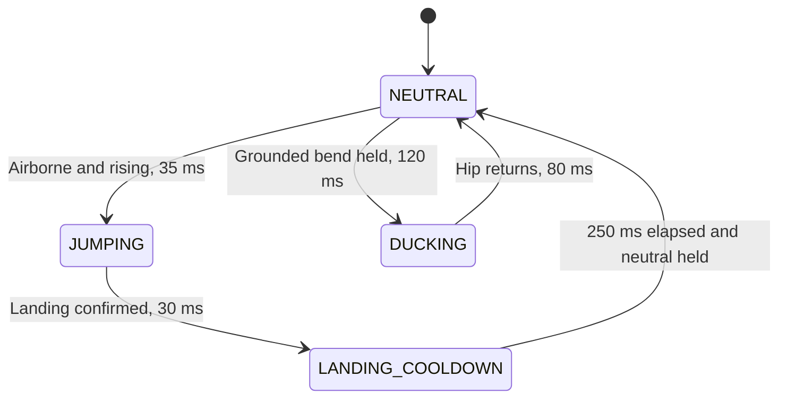

# CV-Controlled Endless Runner

A single-webcam endless runner built with Vite, Phaser 3 and MediaPipe Pose.
Physically **jump** over red hurdles and **duck and hold** under purple barriers.
The browser estimates pose, classifies motion, computes movement metrics and
updates the game locally. The dashboard shows camera/skeleton feedback, state,
biomechanics and live processing performance.

## Setup and execution

Use Node.js 22 or 24, npm, a webcam and a browser with WebAssembly/WebGL support.
The automated checks documented below used Node.js 24.19.0 and Chromium 153.
Run these commands from the repository folder in a terminal (including VS Code's
PowerShell terminal on Windows):

```bash
npm install
npm run dev
```

Open the address Vite prints, normally **http://localhost:3000**. For repeatable
installs from the committed lockfile, use `npm ci` instead of `npm install`.

```bash
npm run test       # Vitest; runs all tests once and exits
npm run build      # Production files in dist/
npm run preview    # Serve the built app locally
```

Camera access requires **HTTPS or localhost**. A plain HTTP LAN address generally
cannot access the camera. Click **Start camera**, grant permission, and allow
model assets to load. If access is denied, change the site's camera permission
in browser settings and retry. Close other applications using the webcam if it
is busy. Embedded deployments must also allow camera access in their iframe and
Permissions Policy. The first model load needs internet access by default.

## Playing and calibration

1. Keep one person fully in frame: shoulders, hips, knees, ankles, heels and toes.
   Use a fixed, level camera and face it while calibrating. Leave headroom and
   floor space in the image for both movements.
2. Stand upright with straight legs and hold still through the **3-second**
   countdown. Calibration requires at least **30 valid observations** and an
   uninterrupted hold. Movement or missing landmarks restarts the hold.
3. Hold neutral briefly to arm the controller. The game starts automatically.
   Jump for red hurdles; duck for purple barriers and stay down until clear.
4. On collision, click **Restart run**, the canvas **Restart** prompt, or press
   **Space**. Choose **Recalibrate / Restart** after moving the camera, changing
   distance/orientation or switching players. Space only restarts after game over.
5. **Stop camera** releases capture. Missing tracking pauses gameplay and score;
   fresh, stable neutral input is required to resume.

Calibration averages these filtered **normalized image** quantities over the hold:

| Baseline field | Calculation |
| --- | --- |
| `baselineHipY` | Mean Y of left/right hips (23, 24) |
| `baselineFootY` | Mean Y of heels and foot indices (29, 30, 31, 32) |
| `torsoHeight` | 2D Euclidean distance between mid-shoulder and mid-hip |
| `shoulderWidth` | 2D Euclidean distance between shoulders (11, 12) |

Image Y increases downward. These distances use normalized XY, not meters.
Raw landmarks must stay within **0.10 × initial torso height** of their initial
positions throughout calibration; this catches cumulative drift. Image-plane
knee interior angles must be at least **160°**. Other upright checks require
torso height ≥ 0.06, shoulder width ≥ 0.04, shoulder-to-hip vertical separation
≥ 85% of torso length, shoulder height difference ≤ 40% of shoulder width, and
hip-to-knee/knee-to-ankle vertical separations ≥ 0.04. These are game heuristics,
not a clinical posture assessment.

## System architecture and model selection

MediaPipe Pose (BlazePose GHUM Lite, `modelComplexity: 0`) was chosen because its
**33 landmarks** include heels and foot indices needed for grounded/takeoff
checks, as well as shoulder, hip, knee and ankle joints. Its detector/tracker
pipeline can reuse tracking between frames. The JavaScript runtime executes
locally using WASM/WebGL; there is **no server inference round trip**. This does
not imply zero processing latency. See the [MediaPipe Pose documentation][pose-docs].

This repository uses the pinned legacy `@mediapipe/pose@0.5.1675469404` and
`@mediapipe/camera_utils@0.3.1675466862` APIs, not the newer Tasks Vision API.
Segmentation and built-in landmark smoothing are disabled. Detection/tracking
confidence thresholds are 0.65; the app applies one explicit EMA itself.

| Module | Responsibility |
| --- | --- |
| `src/vision/PoseTracker.js` | Camera lifecycle, frame timing, inference, visibility gate, EMA, calibration, canvas overlay |
| `src/analytics/Kinematics.js` | Pure geometry and ballistic estimation with invalid-input guards |
| `src/vision/GestureClassifier.js` | Temporal FSM, confidence checks, debouncing, recovery, repetition metrics |
| `src/analytics/PerformanceMonitor.js` | Inference/action timing, processing FPS, session summaries and browser hardware hints |
| `src/game/GameScene.js` | Arcade physics, obstacle pool, score, collision/restart and tracking pause |
| `src/main.js` | Callback wiring, accepted-action timing, DOM analytics and performance HUD |

The per-frame path is camera → MediaPipe → confidence gate/EMA → calibration or
kinematics/FSM → Phaser command → analytics. Drawing and classification run after
the inference timer ends. Only **one inference** is in flight; frames arriving
while it runs are not queued. `requestVideoFrameCallback` schedules fresh video
frames where available. The fallback uses `requestAnimationFrame` and skips an
unchanged `video.currentTime`. The camera utility owns capture; its metadata
scheduling hook is replaced so the application can cancel its own loop cleanly.

Required landmarks are 11/12, 23/24, 25/26, 27/28, 29/30 and 31/32. Any missing,
non-finite, offscreen or visibility **< 0.65** required landmark invalidates input
before filtering. Visibility is never smoothed. The coordinate EMA is:

$$\alpha(\Delta t)=1-(1-0.4)^{\Delta t/(1000/30)},\qquad
\hat p_t=\hat p_{t-1}+\alpha(\Delta t)(p_t-\hat p_{t-1}).$$

Here Δt is in milliseconds (clamped to at least 1 ms). This approximates the same
filter lag at different frame rates. Invalidation clears filter and motion
history, cancels incomplete metrics, releases an active duck once and requires
neutral recovery. Results older than **500 ms** are discarded for control. A
250 ms watchdog invalidates hidden-tab/frozen-camera input; a separate **200 ms**
classifier timestamp-gap limit prevents unsafe velocity estimates across gaps.

Model/WASM files download from a version-pinned jsDelivr URL. Webcam frames and
landmarks are not uploaded by this application. To avoid runtime CDN requests,
copy all runtime/model files from the pinned pose package to a hosted static
folder and pass that URL as `assetBaseUrl` to `PoseTracker`; keep relative asset
names intact. Test that setup before claiming offline operation.

## Detection logic and finite state machine

Let H be calibrated `torsoHeight`, D = (hipY − baselineHipY) / H, and U be upward
hip velocity in torso heights/second. Raw U is `(previousHipY − hipY) / (Δt × H)`
with Δt in seconds, then an exponential velocity filter uses time constant 60 ms.
All gesture timestamps use the source frame's monotonic clock.



| Rule | Exact default condition |
| --- | --- |
| Foot grounded | Either heel or toe of that foot within ±0.06 H of baselineFootY |
| Both feet airborne | All four heel/toe points more than 0.08 H above baselineFootY |
| Neutral/rearm | Both feet grounded, \|D\| ≤ 0.05, mean knee flexion < 25°, \|U\| ≤ 0.12, held for 120 ms |
| Jump trigger | Airborne AND U > 0.6, sustained for 35 ms while armed |
| Landing | Either foot grounded, U ≤ 0.12, ≥100 ms since takeoff, contact sustained for 30 ms |
| Landing cooldown | At least 250 ms **after confirmed landing**, plus stable neutral; no duck trigger in this state |
| Duck start | Both feet grounded, D > 0.15 AND mean knee flexion > 40°, sustained for 120 ms while armed |
| Duck end | Both feet grounded and \|D\| ≤ 0.05 for 80 ms; rearm requires stable neutral again |
| Bottom pause | Hip within 0.03 H of deepest observed duck position and \|U\| ≤ 0.12 for at least 120 ms |
| Invalid flight | Flight lasting >2000 ms, missing geometry, or a frame gap >200 ms discards incomplete flight metrics |

The 0.08/0.06 foot thresholds and 0.15/0.05 hip thresholds provide hysteresis.
Exactly one state branch is evaluated per frame. `JUMPING` cannot trigger a duck
or another jump. A landing knee bend remains recovery **even beyond 250 ms**
until the user stands neutrally. Rising from a duck cannot immediately trigger a
jump. Foot lift without upward hip velocity, head movement, sway and brief
single-frame spikes do not meet the full trigger conditions.

Takeoff time is the **first qualifying airborne/rising frame**, retained through
the debounce window. Landing time is the **first qualifying contact frame**,
retained through its confirmation window. Their difference is the measured
flight time. The peak hip rise includes the takeoff candidate frames and is
`max(0, baselineHipY − minimumHipY)`, in normalized frame-height units.
Bottom pause accumulates qualified stationary segments at the deepest observed
position; a substantially deeper position discards shallower pauses.

Thresholds are constructor-overridable in `GestureClassifier`, subject to
validation (including cooldown ≥250 ms). They still require real-user validation;
synthetic test coverage alone does not establish detection accuracy.

## Biomechanical formulas and coordinate conventions

For three visible points a, b, c in one coordinate scale, define u = a − b and
v = c − b. The interior angle at b is:

$$\theta(a,b,c)=\frac{180}{\pi}\cos^{-1}\left(
\operatorname{clamp}\left(\frac{u\cdot v}{\lVert u\rVert\lVert v\rVert},-1,1\right)\right).$$

Zero-length segments, missing/non-finite coordinates and landmarks with
visibility <0.65 return `null`; the classifier publishes `valid: false` when
required geometry is unavailable. Unknown values display as **—**, not zero.

- **Knee flexion:** `180° − θ(hip, knee, ankle)`. A straight leg is 0°;
  a right-angle bend is 90°. The dashboard averages the two knees.
- **Hip flexion proxy:** `180° − θ(shoulder, hip, knee)`, averaged bilaterally.
  This is an unsigned thigh-to-torso departure from straight neutral. It does
  not isolate anatomical sagittal flexion from extension/abduction or measure
  pelvic orientation.
- **Torso lean:** for t = midShoulder − midHip in aspect-corrected image XY,
  `acos(−t.y / ||t||) × 180/π`. Upright is 0°. Image up `(0, −1)` approximates
  gravity only with a level, fixed camera; forward/backward lean can be hidden
  in a frontal view.
- **Stance width ratio:** `distanceXY(leftAnkle, rightAnkle) / shoulderWidth`.
  Both use the same unscaled normalized image XY as calibration. Perspective,
  camera aspect and changes in orientation can bias this apparent width ratio.

Joint angles prefer MediaPipe `poseWorldLandmarks`, whose estimated 3D
coordinates have an origin between the hips. Image-based fallback maps
`(x, y, z)` to `(aspect × x, y, aspect × z)` because image Z is scaled like X.
World coordinates are inferred from one RGB view; they are not depth-camera
measurements. Hip-relative world translation must **not** be used to measure a
jump. See [output coordinate definitions][pose-docs]. `angleSource` in the metrics
payload identifies `world-3d` or `image-3d-estimate`.

For flight time t in seconds and constant gravity g = 9.81 m/s²:

$$h = \frac{g\cdot t^2}{8}.$$

With equal center-of-mass height at takeoff and landing, total flight time is
twice ascent time: `v₀ = gt/2`, so `h = v₀²/(2g)`. For t = 0.5 s,
**h = 0.3065625 m**. This assumes ballistic flight, constant gravity, negligible
air resistance and symmetric takeoff/landing postures. Knee tuck, landing in a
crouch, toe/heel contact ambiguity, EMA lag and missed frames bias the estimate.
The app timestamps landmark threshold crossings, not a force-plate contact
signal. Estimated jump height is separate from normalized peak hip rise and is
not a validated center-of-mass measurement.

### Squat reference table

These are the **task-specified bands**, used as an explicit implementation
convention. Squat-depth terminology varies between protocols; the table is not
a universal physiotherapy standard. Both values are **flexion angles with 0° at
straight neutral**, not the interior joint angle.

| Output label | Hip flexion | Knee flexion |
| --- | --- | --- |
| Quarter squat | 40–60° | 40–60° |
| Half squat | 70–90° | 70–90° |
| Parallel squat | 90–100° | 90–110° |
| Deep/full squat | 110–130° | 120–150° |

Ranges are inclusive. Deep is checked first, then Parallel, Half and Quarter:
90°/90° therefore returns **Parallel**. Parallel also accepts hips at knee level
(`abs(hipY − kneeY) ≤ 0.02` normalized Y) **if both flexions are at least 40°**.
Both flexions below 40° return `Standing`; gaps/conflicting bands return
`Transition`. Non-finite or out-of-range angles return `null`. The knee-level
shortcut depends on camera perspective. This label alone never triggers ducking:
the FSM still requires grounded feet, hip drop and debounce.

## Performance and latency profiling

The small **Live performance** HUD refreshes four times per second; measurement
occurs on every completed inference. `window.performanceMonitor` exposes
`getLiveMetrics()`, `getSummary(hardwareNotes)`, `logSummary(hardwareNotes)`,
`reset()`, `setActive()`, `recordInference()` and `recordAction()`.

| Metric | Measurement boundary / aggregation |
| --- | --- |
| Model inference latency (ms) | Immediately before `pose.send()` to entry into `onResults`; live mean over the last 2 s, session mean and max in summary |
| End-to-end action latency (ms) | Triggering frame timestamp to return from an **accepted** `scene.jump()` or `scene.duck()` state mutation; HUD shows last accepted action, summary reports mean/max and counts |
| Camera processing FPS | Completed inference results per active second; live 2 s window, session count divided by total visible-camera active duration |

Inference includes SDK preparation, transfer, GPU/WASM work and callback scheduling.
It excludes skeleton drawing, EMA, classifier and DOM work after result delivery.
It is **not** an isolated GPU kernel benchmark. Model initialization/download time
is excluded; first processed frames are included unless the sample is reset.
FPS includes calibration, no-person results and stale completed inferences;
visibility failures must not artificially improve throughput. It is distinct
from camera-configured FPS and Phaser render FPS. Live FPS falls to zero after
1 s without a completed result. Hidden/stopped time is excluded; visible camera
stalls remain in session duration. Live samples are bounded to 240 entries; at
rates above 120 FPS the live window shortens to fit those samples. Session
sums/counts use constant space.

`requestVideoFrameCallback` supplies `captureTime` when the browser exposes it.
Otherwise we use `presentationTime`, or local frame-acquisition time in the RAF
fallback. All timestamps share the `performance.now()` origin. The HUD and summary
identify the source: `camera-capture`, `video-presentation` or `frame-acquisition`.
A fallback **does not include unknown sensor/camera buffering delay**, so it is
only a browser-frame-to-game estimate. See [video frame callback timing][frame-docs].

The action timestamp belongs to the **frame that completes debounce**, not the
first physical movement. Earlier smoothing/debounce history is not represented
in that latency value. It ends at JavaScript game-state mutation, before the
next render/display scanout; `DUCK_END` starts a 90 ms body restoration whose
completion is also outside this boundary. Rejected commands, pre-scene actions,
tracking-loss/reset duck releases and unmatched/duplicate frames are excluded.
No accepted action means a null action average, never a fabricated zero.

### Reproducible target-machine benchmark

1. Record machine model, CPU/GPU, RAM, OS/version, browser/version, camera model,
   lighting and viewing distance. Browser hardware hints may be reduced or
   unavailable, so document exact hardware manually.
2. Run `npm run build` then `npm run preview`, start the camera and calibrate.
   Keep the tab visible; warm the model for at least 10 s.
3. Click **Reset sample**. Run a visible 60 s trial with neutral holds and at
   least 10 jumps and 10 duck/stand cycles. Restart after collisions as needed;
   keep the camera running. Note tracking failures and rejected movements.
4. Click **Log performance summary** and inspect the browser console. For a
   report with manually documented hardware, use:

   ```js
   const report = window.performanceMonitor.logSummary(
     'CPU: …; GPU: …; RAM: …; OS/version: …; camera: …; lighting/distance: …'
   );
   JSON.stringify(report, null, 2);
   ```

5. Save the JSON text with the tested git commit, trial date and protocol notes.
   Repeat three times. Report each trial's `activeSeconds`, `processedFrames`,
   `averageFps`, `averageInferenceMs`, `averageActionLatencyMs`, maxima and
   `acceptedActions`. Retain capture-source counts and actual camera settings.
   Do not treat trials without accepted actions as action-latency measurements.

**Performance status:** live hardware measurements are pending. This repository
does **not** claim 30/60 FPS, a latency target or clinical angle accuracy from
synthetic tests. The profiler supplies the measurements needed for a real-device
submission; populate them using the protocol above.

## Game mechanics and integration API

The game uses primitive flat graphics with no external art assets. Score is
`floor(distance / 10)`; scroll speed increases from **220 to 360 px/s**. High score
persists under `cv-runner.highScore.v1` in localStorage, with graceful fallback
when storage is unavailable. The ground scrolls, and an eight-object reusable
Arcade Physics pool recycles obstacles offscreen.

| Parameter | Value |
| --- | --- |
| Standing / airborne player | 30 × 60 px; green running, blue airborne |
| Duck player | 30 × 28 px, feet anchored; gold; standing restored over 90 ms |
| Jump velocity / gravity | −600 px/s / 1400 px/s² |
| Red ground obstacles | 35–45 px high, 34–44 px wide |
| Purple overhead obstacles | 32 px high, lower edge 36 px above ground |
| Recovery spacing | At least 2.2 s between clearing one obstacle and reaching the next, calculated at maximum speed |
| Restart / tracking-resume protection | 1.5 s of invulnerability, shown by flashing |

`GameScene.jump()` and `duck(isDucking)` return whether a command was accepted.
`restartGame({ recalibrate: false })` reuses the scene/pool, clears the run and
waits for neutral. `setControllerStatus(valid, neutral, reason)` pauses/resumes
physics, scrolling and score. A collision calls `gameOver()` and freezes spawning
and physics until restart.

`PoseTracker(video, canvas, callbacks)` exposes `init()`, `stop()`, `recalibrate()`,
`baseline` and `isRunning`. Callbacks:

- `onPoseUpdate(landmarks, baseline, frame)`; null landmarks invalidate motion.
  Frame metadata includes `timestamp`/`capturedAt`, `frameId`, timing/source fields,
  `aspectRatio` and filtered `worldLandmarks`.
- `onCalibrationComplete(baselineData)` and `onStatusChange(statusText)`.
- `onFrameMetrics(frame)` runs at result entry, including no-pose/calibration
  results; `onStreamStateChange({ active, settings })` reports camera lifecycle.

`GestureClassifier` exposes `update(landmarks, baseline, timestampMs, frame)`,
`reset(baseline)` and `invalidate(reason)`. `onActionTrigger(action, context)` emits
`JUMP`, `DUCK_START` or `DUCK_END`; context marks `source: 'pose'` with timestamp,
or `source: 'safety'` for cancellation releases. One-argument consumers remain
compatible. `onMetricsUpdate(metrics)` includes validity/state plus flightTime
(s), jumpHeight (m), verticalDisplacement (normalized Y), squatDepth, kneeFlexion,
hipFlexion, torsoLean (degrees), stanceWidthRatio and pauseDuration (s).

`main.js` relays `pose:update`, `pose:calibrated`, `gesture:action` and
`gesture:metrics` through Phaser events and stores pose/gesture data in the game
registry. `runner:restartRequested` resets motion history. Camera stop/pagehide
releases capture; hot-module disposal removes timers and listeners.

## Automated test suite and verification

`npm run test` runs deterministic Vitest tests without a camera or network:

| Test file | Coverage |
| --- | --- |
| `tests/Kinematics.test.js` | 3D angles, straight/right-angle flexion, scale/translation invariance, squat boundaries/gaps/precedence, multiple ballistic fixtures including 0.5 s, confidence and degenerate geometry |
| `tests/GestureClassifier.test.js` | Jump → cooldown → neutral and duck → neutral sequences, landing-bend suppression, no simultaneous jump/duck, debounce, pause, visibility loss, timestamp gaps, world-coordinate selection, 30/60 FPS synthetic sampling |
| `tests/PoseTracker.test.js` | Stillness calibration, raw visibility gate, EMA, canvas calls, camera failure/retry/cleanup, sequential scheduling, capture timestamp fallbacks and inference timing before consumers |
| `tests/PerformanceMonitor.test.js` | Known clock intervals, processing FPS, action/frame pairing, invalid samples, stale results, pauses, resets, bounded storage and hardware summaries |
| `tests/main.test.js` | Real classifier wired to mocked Phaser/DOM, command acceptance, HUD metrics, summary/reset controls, safety-release exclusion and visibility handling |

For actual Phaser/browser integration checks (optional extra tooling):

```bash
npm install --no-save --package-lock=false playwright
npx playwright install chromium
npm run test:browser
```

This starts a Vite server on port 3099, launches Chromium and writes screenshots
to a temporary directory. Environment overrides: `PLAYWRIGHT_MODULE`,
`RUNNER_CHROMIUM_EXECUTABLE`, `RUNNER_SCREENSHOT_DIR`. The checks exercise real
collision bodies, jump/duck clearance, standing restoration, score persistence,
restart controls, protection, 40 restarts and five minutes of simulated survival.
They also test a native video callback with a generated canvas stream and pair
synthetic pose frames with accepted real Phaser actions and the performance HUD.
These are integration checks, **not webcam/model inference benchmarks**.

Verification on 2026-10-02: **115 Vitest tests passed**, production build passed,
and the browser suite passed with no JavaScript errors. Environment: Linux
6.18.44 x86_64 container, AMD EPYC 9V74 host-reported CPU, 8 available logical
processors, Node.js 24.19.0, Chromium 153 using software WebGL. No physical
webcam or target-laptop performance was measured. Vite reports a large main
bundle warning due to the included Phaser/runtime code; the build completes.

## Failure modes and limitations

| Condition | Effect and implemented behavior |
| --- | --- |
| Poor lighting / motion blur | Landmarks may become unreliable. Required confidence below 0.65 cancels unfinished motion and pauses gameplay; confident but wrong estimates can still pass. |
| Loose clothing / occlusion | Joint locations may be biased even at high confidence. Angle estimates and depth categories are approximate. |
| Partial body framing | Any required shoulder/leg/heel/toe outside the image invalidates control; calibration cannot finish. |
| Side-on view / rotation | Occlusion and apparent shoulder width change. Recalibrate after changing orientation; all bilateral landmarks must remain visible. A clear sagittal view can aid flexion interpretation but may fail this controller's bilateral visibility gate. |
| Rapid transitions | Debounce, EMA and neutral rearming intentionally reject brief motions; a rapid genuine movement may be missed. Landing bends remain in cooldown until neutral. |
| Slow device / thermal throttling | Sequential inference avoids a growing queue, but fewer frames increase timing uncertainty. Large frame gaps cancel gestures; stale results cannot resume gameplay. |
| Camera disconnect / permission denial / WebGL failure | A readable status is shown; camera/model resources are released. Reconnect or fix permission/support, then start again. |
| Camera movement / distance change | Baseline position and image scales become invalid; recalibrate. There is no automatic camera-motion compensation. |
| Multiple people / background confusion | The model may select the wrong person. The application supports one subject and does not implement identity tracking. |
| Unequal heel/toe baseline / asymmetric posture | One averaged foot baseline can misidentify contact. The flight-time result is a threshold-based estimate, not a contact-sensor measurement. |
| Monocular depth / perspective | Estimated 3D geometry, unsigned hip proxy and image-plane lean are not validated clinical measurements. A second camera or depth sensor is not used. |

The existing tests establish mathematical and state-machine behavior for known
inputs. A final evaluation still needs real-person repetitions, manual false
positive/negative counts, reference angle/contact measurements and a recorded
performance report on the intended machine.

[pose-docs]: https://chuoling.github.io/mediapipe/solutions/pose.html
[frame-docs]: https://developer.mozilla.org/en-US/docs/Web/API/HTMLVideoElement/requestVideoFrameCallback
